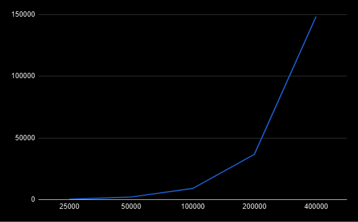
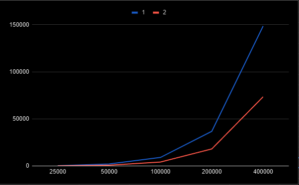
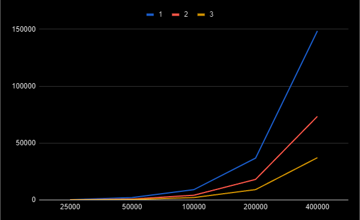
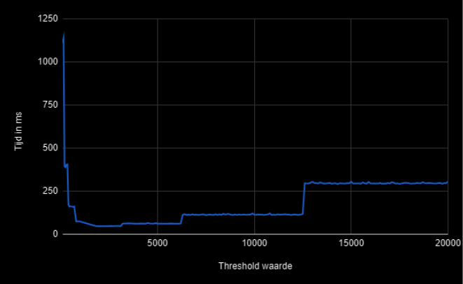
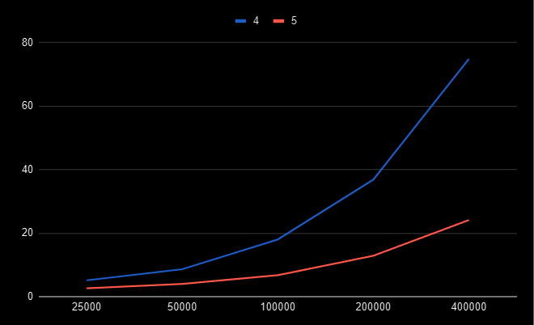

# Parallel Computing - Assignment 1

Je kan de [Main](src/Main.java) klasse runnen, dit geeft een mooi vragenlijstje om de verschillende sorteer methodes te testen.

De andere optie is om alles in een keer te runnen, dit kan met de [TestAlles](test/TestAlles.java) klasse. Hierin worden alle sorteer methodes getest.
Of om de threshold te testen, kan je de [Test](test/Test.java) klasse runnen.


# 1. BubbleSort [Class](src/nl/saxion/paracomp/assignment1/sorters/BubbleSort.java)

Om deze lijst te sorteren, wordt naar elk element in de lijst gekeken. Voor elk element dat wordt bekeken, wordt er door de hele lijst gezocht naar een positie waar deze naast past. Er wordt dus dubbel door de lijst gezocht.

```java
public static int[] bubbleSort(int[] arr) {
    int n = arr.length;
    int temp = 0;
    for (int i = 0; i < n; i++) {
        for (int j = 1; j < (n - i); j++) {
            if (arr[j - 1] > arr[j]) {
                // Wissel elementen
                temp = arr[j - 1];
                arr[j - 1] = arr[j];
                arr[j] = temp;
            }
        }
    }
    return arr;
}
```

Voor alle elementen in de lijst (i) wordt gekeken naar alle andere elementen (j) of deze verplaatst moeten worden. Deze getallen kunnen worden versimpeld weergegeven als dezelfde constante, omdat ze beide altijd gelijk zijn aan de lengte van de lijst (n). De volgende formule kan hieruit worden opgesteld:

#### _****T(n) = n * n = n^2****_

Het algoritme is dus kwadratisch, dit wil zeggen dat voor elke verdubbeling in de lengte van de lijst de tijd vier keer zo groot wordt. Als we naar de data kijken (Figuur 1), zullen we ook zien dat dit het geval is: voor elke verdubbeling van de lengte van de lijst wordt de tijd om het te sorteren verviervoudigd. Dit is het bewijs van een kwadratisch algoritme.



# 2. mergeSort [Class](src/nl/saxion/paracomp/assignment1/sorters/SplitBubbleSort.java)

Hier wordt de lijst in tweeën gesplitst. Deze lijsten worden vervolgens gesorteerd en samengevoegd. Deze methode is ongeveer twee keer zo snel als de BubbleSort-methode. Dit komt doordat de lijst gehalveerd wordt, wat ervoor zorgt dat de tijd van één BubbleSort door vier wordt gedeeld, zoals we hiervoor geconcludeerd hebben.

"Elke verdubbeling van de lengte van de lijst zorgt ervoor dat de tijd om het te sorteren verviervoudigt. Het bewijs van een kwadratisch algoritme."

Waarom is de mergeSort-methode dan slechts twee keer zo snel? Dit komt doordat beide lijsten alsnog achter elkaar gesorteerd moeten worden.

1/4 + 1/4 = 1/2, dus de tijd wordt gehalveerd.



# 3. mergeSort 2 [Class](src/nl/saxion/paracomp/assignment1/sorters/SplitBubbleSort2Threads.java)

Hier gebeurt hetzelfde als bij [2. mergeSort](#2-mergesort-class), alleen wordt de lijst in 2 threads gesorteerd. Dit zorgt ervoor dat de tijd gehalveerd wordt, omdat de 2x 1/4 nu gelijktijdig wordt uitgevoerd, waardoor het 1/4 blijft in vergelijking met BubbleSort.



# 4. mergeSort 3 met limit [Class](src/nl/saxion/paracomp/assignment1/sorters/RecursiveBubbleSort.java)

Hier wordt de lijst gehalveerd en daarna wordt er gekeken of de lijst groot genoeg is om in een thread te sorteren. Als dat niet zo is, wordt de lijst opnieuw gehalveerd.

Nu is de vraag wat de beste threshold is. Hiervoor heb ik de [Test](test/Test.java) klasse gemaakt. Hierin pas ik de baseSorter aan zodat hij alleen sorteert op lijsten met een grootte van 400.000. Waarom zo'n grote lijst? Dit komt omdat bij kleinere lijsten de verschillen minder zichtbaar zijn.

Ik heb twee tests gedaan met twee verschillende stappen van de threshold:

Run 1: vanaf threshold 100 tot 1000 met stappen van 50.  
Run 2: vanaf threshold 1000 tot 20.000 met stappen van 100.



Hieruit kan ik concluderen dat de beste threshold tussen de 1800 en 3100 ligt.

Waarom werkt het verlagen van de threshold niet altijd beter? Je moet een 'sweet spot' vinden tussen het sorteren in een thread en het mergen. Bij een hele kleine threshold wordt er te vaak gemerged, en bij kleine lijsten heeft dit minder nut. Bij een hele grote threshold neemt het sorteren juist te veel tijd in beslag. Zoals eerder geconcludeerd, duurt het sorteren van een lijst 4x zo lang als de lijst 2x zo groot is.

Een ding dat mij opviel is dat op bepaalde punten een sprongetje in de tijd zichtbaar is. Bij **6300** zit een sprongetje, de volgende is bij 2x 6300 = **12600**. En de eerste ligt bij **3100**. Ik verwacht de volgende sprong bij 2x 12600 = **25200**.

# 5. mergeSort 4 met limit en RecursiveTask/ ForkJoinPool [Class](src/nl/saxion/paracomp/assignment1/sorters/RecursiveTaskWrapper.java)

Waarom is dit sneller dan de eigen implementatie van Threads? Dit komt omdat ForkJoinPool een pool van threads heeft die het zelf managed. Als een thread klaar is, hoeft hij niet te wachten op zijn wederhelft, maar kan hij direct verder met een andere taak. Pas als de wederhelft klaar is, wordt er gemerged.

Er worden 16 threads gebruikt, omdat mijn processor 16 threads heeft.



## Systeem
- Processor: AMD Ryzen 7 5700x3d 8-Core Processor @ 4.4GHz boost
- RAM: 32GB
- OS: Windows 10
